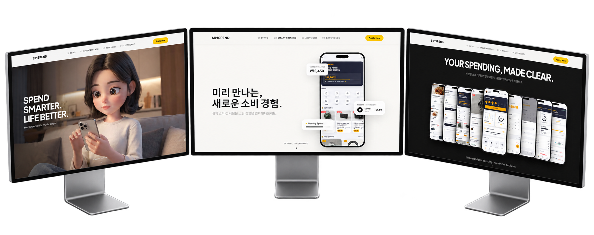

<div align="center">

# 💳 SimSPEND PAGE

### **SPEND SMARTER. LIFE BETTER.**

SimSPEND 앱의 핵심 기능과 브랜드 메시지를  
**스크롤 기반 인터랙션으로 전달하는 프로모션 웹페이지**

[](https://github.com/zinnnnooooo/simspend_page)

<br>


</div>

---

## 💡 Project Overview

**SimSPEND PAGE**는 개인 재무 서비스 **SimSPEND의 핵심 가치와 기능을 효과적으로 전달하기 위해 제작한 인터랙티브 프로모션 웹페이지**입니다.

단순히 앱 화면과 기능을 나열하는 방식에서 벗어나, 사용자가 페이지를 스크롤하는 과정에서 **SimSPEND의 브랜드 메시지와 주요 기능을 하나의 흐름으로 경험할 수 있도록 설계**했습니다.

프레임 기반 스크롤 애니메이션, 스마트폰 UI 전환, 고정형 스크롤 섹션 등 다양한 인터랙션을 활용해 **앱을 직접 사용하기 전에도 SimSPEND가 제안하는 새로운 소비 경험을 직관적으로 이해할 수 있도록 구현**했습니다.

> **앱을 설명하는 웹페이지에서, 앱의 가치를 먼저 경험하는 웹페이지로.**

---

## 🎯 Problem & Goal

기존 앱 소개 페이지는 기능 설명과 화면 나열에 그치기 쉽습니다.

SimSPEND의 차별점인 **소비 전 관리**와 새로운 소비 경험을 더 직관적으로 전달하기 위해, 스크롤과 인터랙션을 중심으로 사용자가 서비스의 흐름을 직접 따라가도록 프로모션 페이지를 구성했습니다.

---

## 📱 Preview

<p align="center">
  
</p>

---

## ✨ Key Features

### 🎞️ Scroll Scrubbing Hero
다수의 이미지 프레임을 스크롤 진행도에 맞춰 순차적으로 전환하여, 사용자가 직접 장면을 움직이는 듯한 Hero 경험을 구현했습니다.

### 📌 Pinned Scroll
주요 섹션을 화면에 고정하고 스크롤 단계에 따라 텍스트와 스마트폰 화면이 변화하도록 구성했습니다.

### 📱 Smartphone UI Transition
SimSPEND의 주요 기능을 스마트폰 Mockup 안에서 단계적으로 전환해 서비스 흐름을 자연스럽게 전달합니다.

### 📊 AI Insight Fan-out
중앙 스마트폰을 기준으로 여러 앱 화면이 좌우로 펼쳐지는 인터랙션을 통해 다양한 기능과 데이터를 한눈에 보여줍니다.

### 🖱️ Tilt & Parallax
마우스 위치와 스크롤에 반응하는 움직임을 적용해 정적인 앱 소개 화면보다 입체적인 경험을 제공합니다.

### 📲 QR Experience
페이지 마지막에 QR을 배치해 프로모션 페이지에서 실제 SimSPEND 경험으로 자연스럽게 연결합니다.

---

## 🧭 Experience Flow


---

## 🛠️ Tech Stack

| Category | Tools |
|---|---|
| **Development** | HTML5, CSS3, JavaScript |
| **Design** | Figma |
| **AI & Vibe Coding** | ChatGPT, Gemini, Claude, Antigravity, Stitch, Google Flow |

---

## 🤖 AI Vibe Coding Process

```text
기획
 ↓
디자인
 ↓
인터랙션 시나리오 정의
 ↓
자연어 기반 개발 요구사항 작성
 ↓
HTML / CSS / JavaScript 구현
 ↓
테스트
 ↓
피드백 & Re-Prompting
 ↓
인터랙션 고도화
 ↓
최종 웹페이지 완성
```

AI를 단순한 코드 생성 도구가 아니라, **원하는 움직임과 사용자 경험을 자연어로 정의하고 결과를 반복적으로 수정하는 협업 도구**로 활용했습니다.

---

## 💬 Prompt Examples

### Scroll Scrubbing

```text
Hero의 전체적인 디자인과 구도는 유지합니다.

스크롤을 내리면 준비된 이미지 프레임이
스크롤 진행도에 맞춰 순차적으로 변경되도록 구현합니다.

사용자가 스크롤을 멈추면 해당 프레임에서 멈추고,
다시 스크롤하면 자연스럽게 이어지도록 합니다.
```

### Pinned Scroll

```text
섹션이 화면에 들어오면 주요 영역을 고정합니다.

스크롤 단계에 따라 텍스트와 스마트폰 화면이
순차적으로 변경되도록 구성합니다.

각 단계의 전환은 끊기지 않고 자연스럽게 이어지도록 합니다.
```

### AI Insight Fan-out

```text
중앙 스마트폰을 기준으로 여러 앱 화면이
스크롤 진행도에 따라 좌우로 펼쳐지도록 구현합니다.

처음에는 중앙 화면에 집중시키고,
스크롤을 내릴수록 나머지 화면이 단계적으로 등장하도록 합니다.
```

---

## 🗂️ Project Structure

```text
simspend_page/
├── design/
├── frames/
├── backup/
├── index.html
├── style.css
├── main.js
└── README.md
```

---

## 📝 What I Learned

> **좋은 프로모션 페이지는 기능을 많이 설명하는 것이 아니라, 사용자가 스크롤하는 과정에서 서비스의 가치를 자연스럽게 이해하도록 만드는 것이라는 점을 경험했습니다.**

프레임 기반 Scroll Scrubbing과 Pinned Scroll을 구현하면서 **스크롤 위치, 애니메이션 진행도, 콘텐츠 전환 타이밍을 하나의 흐름으로 설계하는 과정**의 중요성을 배웠습니다.

또한 앱 UI를 단순히 이미지로 보여주는 것보다, Mockup의 움직임과 콘텐츠 등장 순서를 함께 설계했을 때 **제품의 기능뿐 아니라 브랜드의 분위기까지 전달할 수 있다는 점**을 확인했습니다.

---

## 🔗 Links

- [GitHub Repository](https://github.com/zinnnnooooo/simspend_page)

---

## © Copyright

© 2026 Jinho Park. All rights reserved.
